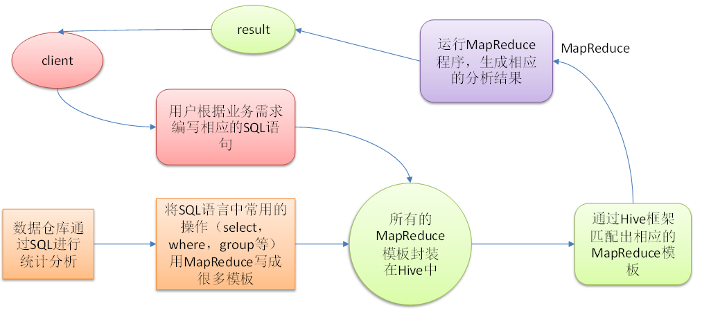
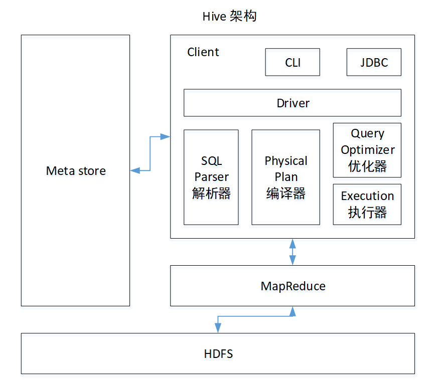

#Hive概述

Hive是基于Hadoop的一个数仓工具。可以将结构化的数据映射成一张表，并且用类似SQL的语句实现查询。本质上就是把SQL(HQL)语句转化成MapReduce.

####Hive的特点

<ul>
<li>操作接口采用类SQL语法，提供快速开发的能力</li>
<li>避免写MapReduce</li>
<li>执行延迟高，常用于对实时性要求不高的场合</li>
<li>处理大数据有优势，适合做海量数据的离线处理</li>
<li>支持用户自定义函数</li>
</ul>

####架构原理

 
:heavy_check_mark: 用户接口Client 
CLI(hive命令行),JDBC(Java访问hive),web端访问 

:heavy_check_mark: 元数据MetaStore 
表名，表所属数据库，表的拥有者，分区字段，表的类型（内部/外部表），数据所在目录。元数据默认在自带的derby数据库，后面修改成会使用MySql

:heavy_check_mark: Hadoop
使用HDFS进行存储，使用MapReduce进行计算
