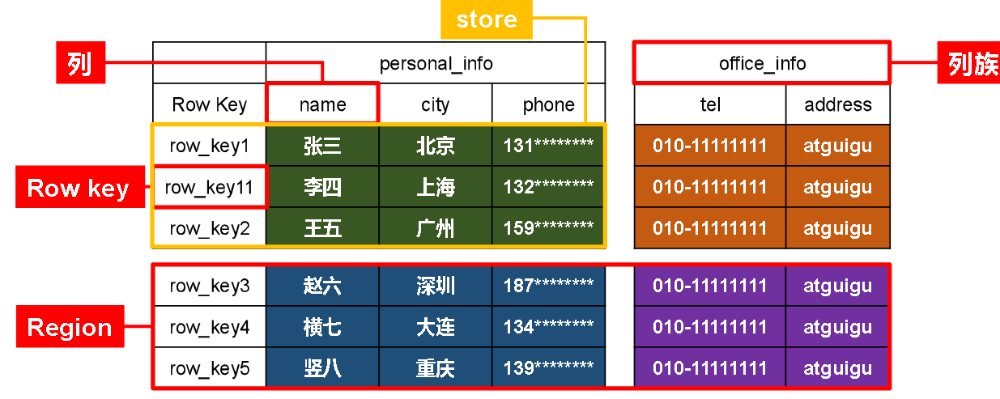
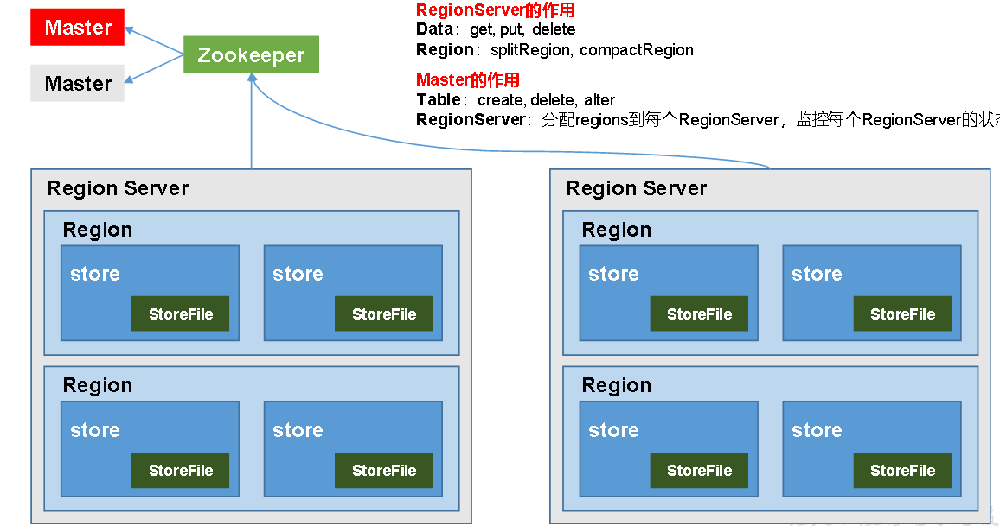

#Hbase
<hr style="height:1px;border:none;border-top:1px solid #555555;" />
Hbase是分布式的，支持海量数据的NoSql数据库

#数据模型
逻辑上，HBase的数据模型同关系型数据库很类似，数据存储在一张表中，有行有列。但从HBase的底层物理存储结构（K-V）来看，HBase更像是一个multi-dimensional map。
#### 逻辑结构


列族 :每一个列必须属于列族

region : 表的切片

在hdfs系统中的存储结构是 /表/region/columfamily（列族）

#### 物理结构


删除，改操作实际上是加了一个新的行，新的时间戳。等系统闲下来再真的删

# 数据类型
#### namespace
和mysql中的database类似，每个命名空间下面可以有多个表。Hbase自带的命名空间：hbase(内置的设置), default(用户默认的命名空间)

#### Region
leisi yu 和mysql中的表类似，但是定义表的时候声明列族即可，在写数据时候字段可以动态指定

#### Row
每行数据都由rowkey和多个列构成，数据按照rowkey按照字典顺序存储
####column
每个列都必须用列族和限定字符进行限定

####time stamp
用于表示数据的不同版本，如果写入数据时候不加时间戳，系统也会自动加上

####cell
由rowkey. colum family, colum qualifier, 时间戳唯一确定的单元，只有一种类型，是字节码

#基本架构
<hr style="height:1px;border:none;border-top:1px solid #555555;" />

#### region server
管理region， 对数据进行get put delete操作     对region进行：切分(splitRegion), 合并(compactRegion)
#### master
存储元数据，管理region server。分配新创建的region,负载均衡和故障转移    对region进行:create delete alter ， region server:监控，分配regions到region server
zookeeper协助找元数据，客户端读写请求都给他操作

####hdfs
HDFS为HBase提供最终的底层数据存储服务，同时为HBase提供高可用的支持

#HBase安装部署

先把集群的zookeeper和hdfs打开

解压安装文件

进入hbase/conf/hbase-env.sh 修改下 JAVA_HOME,并把HBASE_MANAGES_ZK改成false（不用hbase内置的zookeeper）

修改hbase-site.xml
```
<configuration>
	<property>
		<name>hbase.rootdir</name>
		<value>hdfs://hadoop102:9000/HBase</value>
	</property>

	<property>
		<name>hbase.cluster.distributed</name>
		<value>true</value>
	</property>

   <!-- 0.98后的新变动，之前版本没有.port,默认端口为60000 -->
	<property>
		<name>hbase.master.port</name>
		<value>16000</value>
	</property>

	<property>  
		<name>hbase.zookeeper.quorum</name>
	    <value>hadoop102,hadoop103,hadoop104</value>
	</property>

	<property>  
		<name>hbase.zookeeper.property.dataDir</name>
	    <value>/opt/module/zookeeper-3.4.10/zkData</value>
	</property>
</configuration>
```
再把region server加入集群中机器的名字

软连接hadoop配置文件到Hbase
```
ln -s /opt/module/hadoop-2.7.2/etc/hadoop/core-site.xml /opt/module/hbase/conf/core-site.xml
ln -s /opt/module/hadoop-2.7.2/etc/hadoop/hdfs-site.xml /opt/module/hbase/conf/hdfs-site.xml
```
集群机器都装上Hbase并配置


#### 服务启动
来到hbase目录
`bin/start-hbase.sh`

可以在web端查看 `http://hadoop102:16010`

#### HBase Shell操作

进入客户端
`bin/hbase shell`

查看有什么表
`list`

创建表（至少要指定类族）
`create 'student', 'info'`

插入数据
`put 'student', '1001','info:name','Dick'

 put 'student','1002','info:name','Janna'

 put 'student','1002','info:sex','female'

 put 'student','1002','info:age','20'`

扫描查看
`scan 'student'`
`scan 'student',{STARTROW => '1001', STOPROW  => '1001'}`

查看表结构
`describe 'student' `

查看指定行的数据
`get 'student','1001'`

查看指定列族：列的数据
`get 'student','1001', 'info:name'`

统计表数据的行数
`count 'student'`

删除数据

删除rowkey下全部数据 `deleteall 'student', '1001'`

删除某一列的数据`delete 'student','1002','info:sex'`

清空表 `truncate 'student'`

删除表

先把表转成disable状态`disable 'student'`

drop表 `drop 'student'`
