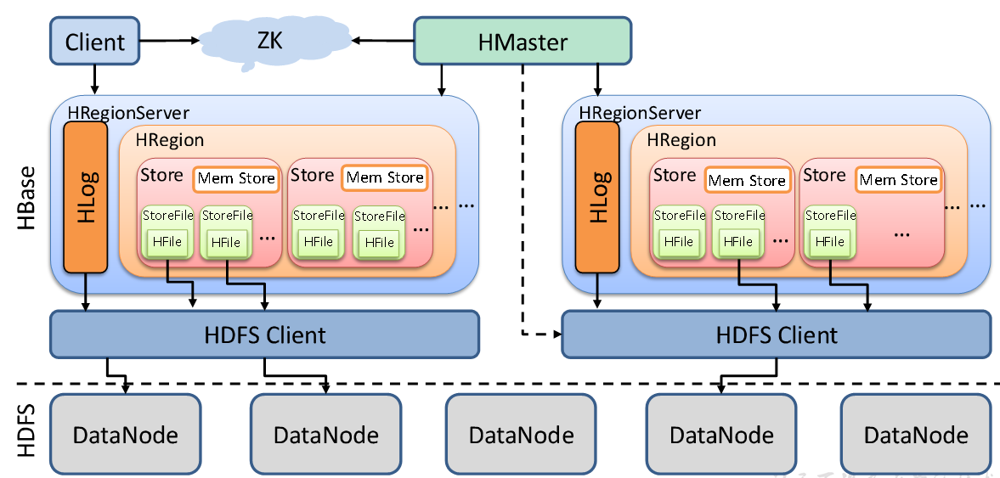
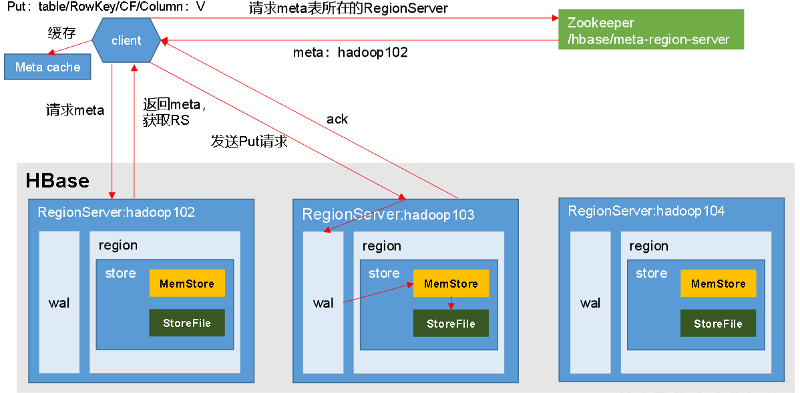

#HBase进阶

#架构原理

#### StoreFile
保存实际数据的物理文件，以HFile形式存储在HDFS上，每个Store都会多个HFile,数据在HFile内都是有序的

#### MemStore
在内存中存储的数据，排好序后flush给HFile，每次flush都会形成新的HFile

#### WAL
为了防止数丢失，数据会先写在一个叫做Write-Ahead logfile的文件中，然后再写入MemStore中。所以在系统出现故障的时候，数据可以通过这个日志文件重建。

#写流程

1 client 先访问zookeeper， 获取hbase:meta表位于哪个RegionServer
2 访问RegionServer, 获取hbase:meta表，根据读请求的 namespace:table/rowkey找到数据在哪个RegionServer的哪个Region中。将该表的region信息和meta表位置缓存在客户端
3 与目标RegionServer进行通信
4 数据追加到WAL
5 数据写入内存MemStore，排序
6 向客户端发送ack
7 MemStore的flush时候写入HFile

# MemStore 的 flush

刷写时机
1.当某个memstore的大小达到了hbase.hregion.memstore.flush.size（默认值128M），其所在region的所有memstore都会刷写。
当memstore的大小达到了

hbase.hregion.memstore.flush.size（默认值128M）
hbase.hregion.memstore.block.multiplier（默认值4）

时，会阻止继续往该memstore写数据。

2.当region server中memstore的总大小达到

java_heapsize

hbase.regionserver.global.memstore.size（默认值0.4）

hbase.regionserver.global.memstore.size.lower.limit（默认值0.95），

region会按照其所有memstore的大小顺序（由大到小）依次进行刷写。直到region server中所有memstore的总大小减小到上述值以下。
当region server中memstore的总大小达到java_heapsize*hbase.regionserver.global.memstore.size（默认值0.4）
时，会阻止继续往所有的memstore写数据。

3. 到达自动刷写的时间，也会触发memstore flush。自动刷新的时间间隔由该属性进行配置hbase.regionserver.optionalcacheflushinterval（默认1小时）。

4.当WAL文件的数量超过hbase.regionserver.max.logs，region会按照时间顺序依次进行刷写，直到WAL文件数量减小到hbase.regionserver.max.log以下（该属性名已经废弃，现无需手动设置，最大值为32）。
