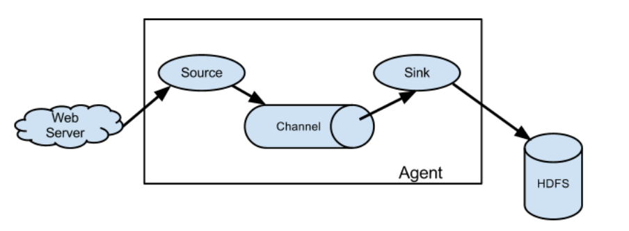
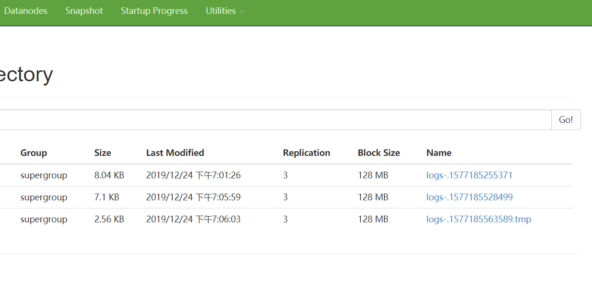

#Flume概述
<hr style="height:1px;border:none;border-top:1px solid #555555;" />
Flume是一种基于流式架构的日志采集，聚合和传输系统。可以用来把Java EE平台的日志数据（比如实时推荐）传输给HDFS
主要目的：实时读取服务器日志，写到HDFS中

#架构
<hr style="height:1px;border:none;border-top:1px solid #555555;" />

Agent:JVM进程。以事件（event）的形式把数据传送到目的地，主要由三部分组成：source,channel,sink

:herb: source: 负责生产事件（接收数据）。Source组件可以处理各种类型的日志数据，包括avro, thrift, exec, jms netcat等等

:herb:channel:是source和sink中间的缓冲区，这样两端读写速度可以不同。同时channel是线程安全 ，可以对接多个source和sink。channel分为：Memory channel（内存存储）或者File channel(磁盘中)，Kafka channel

:herb: sink: 负责消费事件。不断轮询channel中的数据并且批量清除数据，并将这些数据写入到存储或者另一个flume。可以写入hdfs,logger控制台,avro,file等等。

:herb: event :flume传输数据的形式，由 header(kv结构) + body（字节数组）组成

Avro source: 对接多个flume
Exec source

#flume安装
<hr style="height:1px;border:none;border-top:1px solid #555555;" />
<a href = 'http://flume.apache.org/'>Flume官网地址</a>

<a href = 'http://flume.apache.org/FlumeUserGuide.html'>文档查看地址</a>

<a href = 'http://archive.apache.org/dist/flume/'>下载地址</a>

将apache-flume-1.7.0-bin.tar.gz解压到你的目录下，为了方便可以改名成flume

修改flume/conf/flume-env.sh.template配置文件

`mv flume-env.sh.template flume-env.sh`

然后修改文件中的Java路径变成自己的

`export JAVA_HOME=/opt/module/jdk1.8.0_144`

#入门案例
<hr style="height:1px;border:none;border-top:1px solid #555555;" />
#### case 1 监控端口
用flume从端口接收数据，打印到控制台
首先安装下netcat
`sudo yum install -y nc`

在flume目录下创建job文件专门存配置文件夹并进入job文件夹,自定义一个配置文件
`vim flume-netcat-logger.conf`
在文件中写入
```
# Name the components on this agent
# a1(agent)的source，sink, channel名称
a1.sources = r1
a1.sinks = k1
a1.channels = c1

# Describe/configure the source
#a1输入源是端口
a1.sources.r1.type = netcat
#a1监听主机
a1.sources.r1.bind = localhost
#a1端口号（你自己随便指定一个没有被占用的）
a1.sources.r1.port = 44444

# Describe the sink
#输出目的地是控制台logger类型
a1.sinks.k1.type = logger

# Use a channel which buffers events in memory
#channel设置成再内存中存储
a1.channels.c1.type = memory
#channel最大容量1000个event
a1.channels.c1.capacity = 1000
#channel收集到100条再提交事务
a1.channels.c1.transactionCapacity = 100

# Bind the source and sink to the channel
#把source 和 sink 连接到channel上
a1.sources.r1.channels = c1
a1.sinks.k1.channel = c1
```
然后还要做两件事：启动flume和向4444端口发送数据
启动flume
`bin/flume-ng agent --conf conf/ --name a1 --conf-file job/flume-netcat-logger.conf -Dflume.root.logger=INFO,console`<br>
或者<br>
`bin/flume-ng agent -c conf/ -n a1 -f job/flume-netcat-logger.conf -Dflume.root.logger=INFO,console`<br>
这里说明下
<ul>
<li>--conf/-c : 配置文件存储位置</li>
<li>-name/-n : Agent的名字</li>
<li>--conf-file/-f : 配置文件的地方</li>
<li>-Dflume.root.logger : flume动态修改flume.root.logger参数属性值，并将控制台日志打印级别设置为INFO级别。日志级别包括:log、info、warn、error。</li>
</ul>

向4444端口发送数据
`nc localhost 4444
hello
`
Flume监听页面收到了消息

#### case 2 监控单个追加文件
目标：监控Hive日志文件，并上传到HDFS

Flume要想将数据输出到HDFS，须持有Hadoop相关jar包 (在resource下的flume-hadoop-jar.rar),解压后放在flume/lib文件夹下。

在job下创建配置文件 `vim flume-file-hdfs.conf`
然后添加
```
# Name the components on this agent
a2.sources = r2
a2.sinks = k2
a2.channels = c2

# Describe/configure the source
#定义source类型为exec可执行命令
a2.sources.r2.type = exec
#命令
a2.sources.r2.command = tail -F /opt/module/hive/logs/hive.log
a2.sources.r2.shell = /bin/bash -c 执行shell脚本的路径

# Describe the sink
a2.sinks.k2.type = hdfs
a2.sinks.k2.hdfs.path = hdfs://hadoop102:9000/flume/%Y%m%d/%H
#上传文件的前缀
a2.sinks.k2.hdfs.filePrefix = logs-
#是否按照时间滚动文件夹
a2.sinks.k2.hdfs.round = true
#多少时间单位创建一个新的文件夹
a2.sinks.k2.hdfs.roundValue = 1
#重新定义时间单位
a2.sinks.k2.hdfs.roundUnit = hour
#是否使用本地时间戳
a2.sinks.k2.hdfs.useLocalTimeStamp = true
#积攒多少个Event才flush到HDFS一次
a2.sinks.k2.hdfs.batchSize = 1000
#设置文件类型，可支持压缩
a2.sinks.k2.hdfs.fileType = DataStream
#多久生成一个新的文件（秒）
a2.sinks.k2.hdfs.rollInterval = 30
#设置每个文件的滚动大小
a2.sinks.k2.hdfs.rollSize = 134217700
#文件的滚动与Event数量无关
a2.sinks.k2.hdfs.rollCount = 0

# Use a channel which buffers events in memory
a2.channels.c2.type = memory
a2.channels.c2.capacity = 1000
a2.channels.c2.transactionCapacity = 100

# Bind the source and sink to the channel
a2.sources.r2.channels = c2
a2.sinks.k2.channel = c2
```
打开flume
`bin/flume-ng agent --conf conf/ --name a2 --conf-file job/flume-file-hdfs.conf`<br>

把集群、Hive打开

在hive上随便进行些操作后查看hdfs下面的flume文件



#### case 3 实时监控目录下多个新文件
监听整个目录的文件变化，上传到HDFS

创建配置文件
`vim flume-dir-hdfs.conf`<br>
然后添加如下内容
```
a3.sources = r3
a3.sinks = k3
a3.channels = c3

# Describe/configure the source
a3.sources.r3.type = spooldir
#监控目录
a3.sources.r3.spoolDir = /opt/module/flume/upload
a3.sources.r3.fileSuffix = .COMPLETED
a3.sources.r3.fileHeader = true
#忽略所有以.tmp结尾的文件，不上传。上传完成的文件会以.COMPLETED结尾
a3.sources.r3.ignorePattern = ([^ ]*\.tmp)

# Describe the sink
a3.sinks.k3.type = hdfs
#上传到HDFS的路径
a3.sinks.k3.hdfs.path = hdfs://hadoop102:9000/flume/upload/%Y%m%d/%H
#上传文件的前缀
a3.sinks.k3.hdfs.filePrefix = upload-
#是否按照时间滚动文件夹
a3.sinks.k3.hdfs.round = true
#多少时间单位创建一个新的文件夹
a3.sinks.k3.hdfs.roundValue = 1
#重新定义时间单位
a3.sinks.k3.hdfs.roundUnit = hour
#是否使用本地时间戳
a3.sinks.k3.hdfs.useLocalTimeStamp = true
#积攒多少个Event才flush到HDFS一次
a3.sinks.k3.hdfs.batchSize = 100
#设置文件类型，可支持压缩
a3.sinks.k3.hdfs.fileType = DataStream
#多久生成一个新的文件
a3.sinks.k3.hdfs.rollInterval = 60
#设置每个文件的滚动大小大概是128M
a3.sinks.k3.hdfs.rollSize = 134217700
#文件的滚动与Event数量无关
a3.sinks.k3.hdfs.rollCount = 0

# Use a channel which buffers events in memory
a3.channels.c3.type = memory
a3.channels.c3.capacity = 1000
a3.channels.c3.transactionCapacity = 100

# Bind the source and sink to the channel
a3.sources.r3.channels = c3
a3.sinks.k3.channel = c3
```

#### case 4 追加文件监控

case 3中监控的是文件名字，如果你向一个文件中追加内容是不会被记录下来的。如果想记录追加文件监控，需要使用taildir类别的source

用positionfile 记录位置文件，flume中途关机，再启动也会记录

```
a3.sources = r3
a3.sinks = k3
a3.channels = c3

# Describe/configure the source
a3.sources.r3.type = TAILDIR
# positionfile的位置
a3.sources.r3.positionFile = /opt/module/flume/tail_dir.json
a3.sources.r3.filegroups = f1
# 监控的文件目录
a3.sources.r3.filegroups.f1 = /opt/module/flume/files/file.*

# Describe the sink
a3.sinks.k3.type = hdfs
a3.sinks.k3.hdfs.path = hdfs://hadoop102:9000/flume/upload/%Y%m%d/%H
#上传文件的前缀
a3.sinks.k3.hdfs.filePrefix = upload-
#是否按照时间滚动文件夹
a3.sinks.k3.hdfs.round = true
#多少时间单位创建一个新的文件夹
a3.sinks.k3.hdfs.roundValue = 1
#重新定义时间单位
a3.sinks.k3.hdfs.roundUnit = hour
#是否使用本地时间戳
a3.sinks.k3.hdfs.useLocalTimeStamp = true
#积攒多少个Event才flush到HDFS一次
a3.sinks.k3.hdfs.batchSize = 100
#设置文件类型，可支持压缩
a3.sinks.k3.hdfs.fileType = DataStream
#多久生成一个新的文件
a3.sinks.k3.hdfs.rollInterval = 60
#设置每个文件的滚动大小大概是128M
a3.sinks.k3.hdfs.rollSize = 134217700
#文件的滚动与Event数量无关
a3.sinks.k3.hdfs.rollCount = 0

# Use a channel which buffers events in memory
a3.channels.c3.type = memory
a3.channels.c3.capacity = 1000
a3.channels.c3.transactionCapacity = 100

# Bind the source and sink to the channel
a3.sources.r3.channels = c3
a3.sinks.k3.channel = c3
```


hdfs.rollInterval 滚动生成新文件 默认30秒
hdfs.rollsize
hdfs.rollcount
hdfs.round 文件夹滚动
