#flume进阶/企业开发案例
<hr style="height:1px;border:none;border-top:1px solid #555555;" />

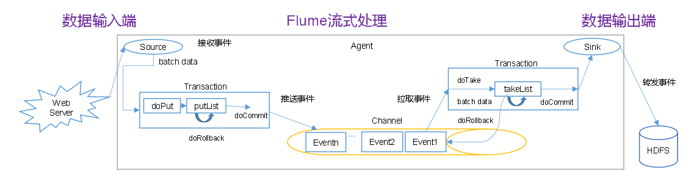
:herb: put事务流程
doPut将数据先写入临时缓冲区,临时缓冲区putlist把source采集的数据，提交到channel，等待chennel答复，如果不足，回滚

:herb: take事务
临时缓冲区takelist：toTake把事务从channel拉过来，doCommit发送成功，清除缓存区，否则drollback

#flume agent内部原理
<hr style="height:1px;border:none;border-top:1px solid #555555;" />
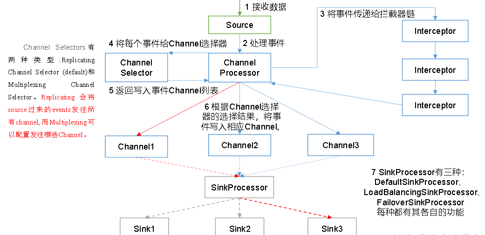
:herb: ChannelSelector<br>
作用就是选出Event将要被发往哪个Channel。其共有两种类型，分别是Replicating（复制）和Multiplexing（多路复用）。ReplicatingSelector会将同一个Event发往所有的Channel，Multiplexing会根据相应的原则，将不同的Event发往不同的Channel。

:herb: interception链<br>
interception独立于 channel_processor是因为筛选逻辑经常会变（可插拔功能）

:herb: sink processor<br>
SinkProcessor共有三种类型，分别是DefaultSinkProcessor、LoadBalancingSinkProcessor和FailoverSinkProcessor
DefaultSinkProcessor对应的是单个的Sink，LoadBalancingSinkProcessor和FailoverSinkProcessor对应的是Sink Group，LoadBalancingSinkProcessor可以实现负载均衡的功能，FailoverSinkProcessor可以实现故障转移的功能。


#flume拓扑结构
<hr style="height:1px;border:none;border-top:1px solid #555555;" />

:herb: 简单串联<br>
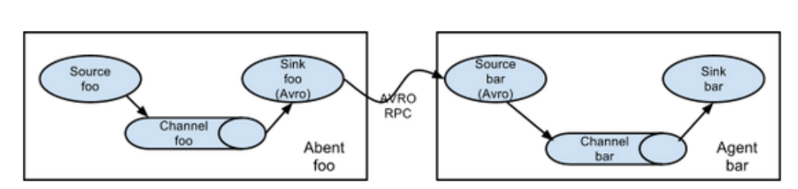
前面是客户端 后面是服务端（先启动服务端，再启动服务端），这样风险会变大，相连的部分需要用avro类型的sink和source。这种模式是将多个flume顺序连接起来了，从最初的source开始到最终sink传送的目的存储系统。此模式不建议桥接过多的flume数量，flume数量过多不仅会影响传输速率，而且一旦传输过程中某个节点flume宕机，会影响整个传输系统。

:herb: 复制和多路复用<br>
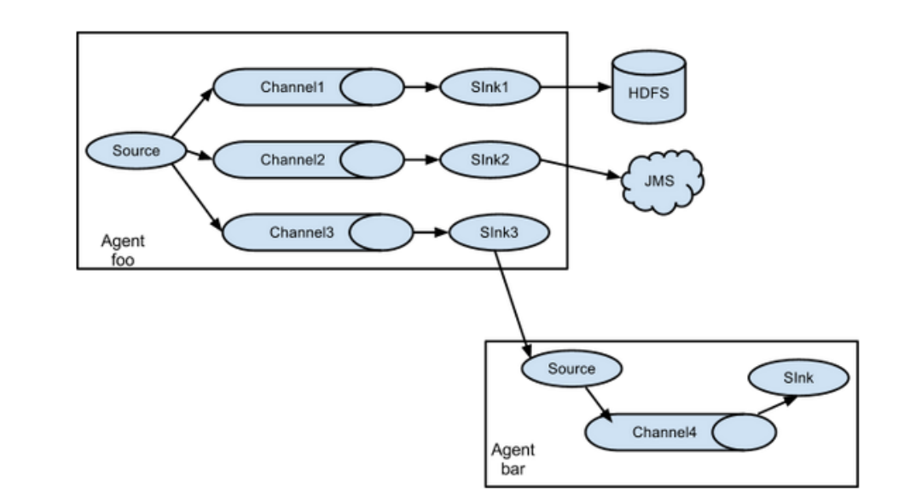
Flume支持将事件流向一个或者多个目的地。这种模式可以将相同数据复制到多个channel中，或者将不同数据分发到不同的channel中，sink可以选择传送到不同的目的地。

:herb: 负载均衡和故障转移
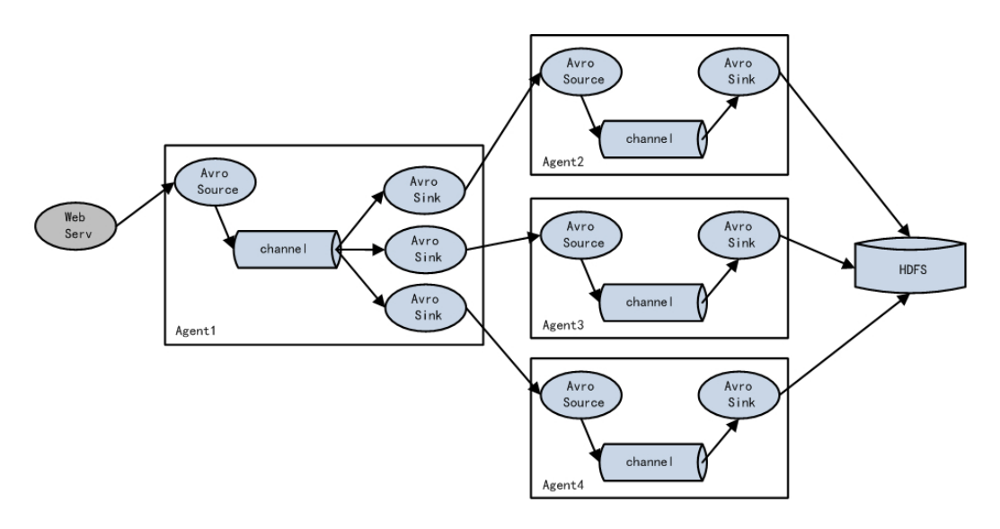  
Flume支持使用将多个sink逻辑上分到一个sink组，sink组配合不同的SinkProcessor可以实现负载均衡和错误恢复的功能。注意这里说的故障是针对后面三个，如果前面的挂了就全完了。

:herb: 聚合
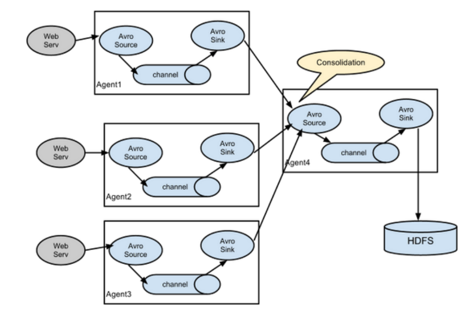
最常见实用，web应用通常分布在上百个服务器。产生的日志，处理起来也非常麻烦。用flume的这种组合方式能很好的解决这一问题，每台服务器部署一个flume采集日志，传送到一个集中收集日志的flume，再由此flume上传到hdfs、hive、hbase等，进行日志分析。


#企业开发案例
<hr style="height:1px;border:none;border-top:1px solid #555555;" />

### case1 复制和多路复用(单源多出口)
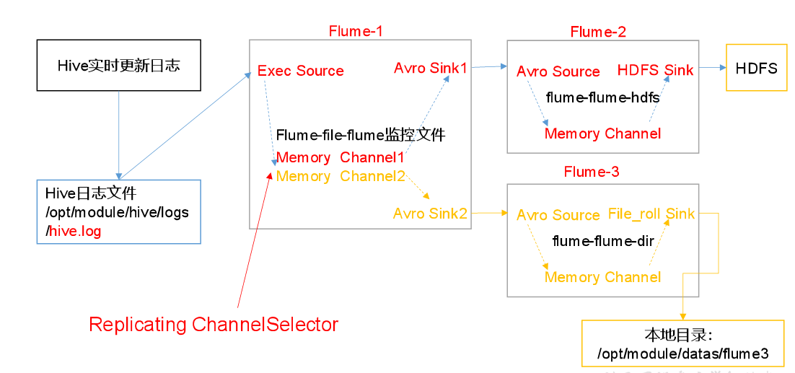
需求：监听hive日志，输出到HDFS 和 本地目录中
逻辑：一个信息输出到多个目的地，flume1需要两个channel，把ChannelSelector属性配置成Replicating

#### 1.1准备工作
在job文件夹下新建group1文件夹（存放配置文件）
`mkdir group1`
新建flume3文件夹（你要输出的文件夹）
`mkdir fkume3`
#### 1.2配置文件
`vim flume-file-flume.conf`
```
a1.sources = r1
a1.sink = k1, k2
a1.channel = c1, c2

a1.sources.r1.selector.type = replicating

a1.sources.r1.type = exec
a1.sources.r1.command = tail -F hive日志路径
a1.sources.r1.shell = /bin/bash -c

a1.sink.k1.type = avro
a1.sink.k1.hostname = hadoop102(hive主机名)
a1.sink.k1.port = 4141

a1.sinks.k2.type = avro
a1.sinks.k2.hostname = hadoop102
a1.sinks.k2.port = 4142


a1.channels.c1.type = memory
a1.channels.c1.capacity = 1000
a1.channels.c1.transactionCapacity = 100

a1.channels.c2.type = memory
a1.channels.c2.capacity = 1000
a1.channels.c2.transactionCapacity = 100

a1.sources.r1.channels = c1 c2
a1.sink.k1.channels = c1
a1.sink.k2.channels = c2
```

下面就是两个接收flume1的flume2和flume3
`vim flume-flume-hdfs.conf`
添加如下内容
```
# Name the components on this agent
a2.sources = r1
a2.sinks = k1
a2.channels = c1

# Describe/configure the source
a2.sources.r1.type = avro
a2.sources.r1.bind = hadoop102
a2.sources.r1.port = 4141

# Describe the sink
a2.sinks.k1.type = hdfs
a2.sinks.k1.hdfs.path = hdfs://hadoop102:9000/flume2/%Y%m%d/%H
a2.sinks.k1.hdfs.filePrefix = flume2-
a2.sinks.k1.hdfs.round = true
a2.sinks.k1.hdfs.roundValue = 1
a2.sinks.k1.hdfs.roundUnit = hour
a2.sinks.k1.hdfs.useLocalTimeStamp = true
a2.sinks.k1.hdfs.batchSize = 100
a2.sinks.k1.hdfs.fileType = DataStream
a2.sinks.k1.hdfs.rollInterval = 600
a2.sinks.k1.hdfs.rollSize = 134217700
a2.sinks.k1.hdfs.rollCount = 0

a2.channels.c1.type = memory
a2.channels.c1.capacity = 1000
a2.channels.c1.transactionCapacity = 100

a2.sources.r1.channels = c1
a2.sinks.k1.channel = c1
```
创建flume3
`vim flume-flume-hdfs.conf`
```
# Name the components on this agent
a3.sources = r1
a3.sinks = k1
a3.channels = c2

# Describe/configure the source
a3.sources.r1.type = avro
a3.sources.r1.bind = hadoop102
a3.sources.r1.port = 4142

# Describe the sink
a3.sinks.k1.type = file_roll
a3.sinks.k1.sink.directory = /opt/module/data/flume3

# Describe the channel
a3.channels.c2.type = memory
a3.channels.c2.capacity = 1000
a3.channels.c2.transactionCapacity = 100

# Bind the source and sink to the channel
a3.sources.r1.channels = c2
a3.sinks.k1.channel = c2
```
启动三个flume
```
bin/flume-ng agent --conf conf/ --name a3 --conf-file job/group1/flume-flume-dir.conf

bin/flume-ng agent --conf conf/ --name a2 --conf-file job/group1/flume-flume-hdfs.conf

bin/flume-ng agent --conf conf/ --name a1 --conf-file job/group1/flume-file-flume.conf
```
开集群，开hive

### case2 负载均衡和故障转移
需求：监听一个文件，一个flume连两个flume再输出到控制台，当下游一个flume挂了的时候依然可以运作
逻辑：flume1的sinkgroups.processor使用failover类型。这个就简略不写了，大同小异。

### case3 聚合
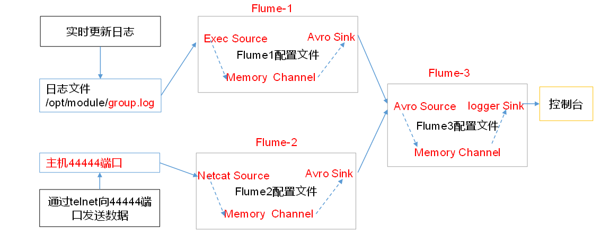
服务器1上的Flume-1监控文件/opt/module/data/group.log,flume1 监控端口 netcat source  avro sink

服务器2上的Flume-2监控某一个端口的数据流,flume2 监控文件 exec source    avro sink

Flume-1与Flume-2将数据发送给服务器3上的Flume-3，Flume-3将最终数据打印到控制台flume3 avro source  logger sink

首先记得每台服务器都装好flume！

服务器1上的配置文件
`vim flume1-logger-flume.conf`
添加内容
```
# Name the components on this agent
a1.sources = r1
a1.sinks = k1
a1.channels = c1

# Describe/configure the source
a1.sources.r1.type = exec
a1.sources.r1.command = tail -F /opt/module/group.log（监控文件）
a1.sources.r1.shell = /bin/bash -c

# Describe the sink
a1.sinks.k1.type = avro
a1.sinks.k1.hostname = hadoop104
a1.sinks.k1.port = 4141

# Describe the channel
a1.channels.c1.type = memory
a1.channels.c1.capacity = 1000
a1.channels.c1.transactionCapacity = 100

# Bind the source and sink to the channel
a1.sources.r1.channels = c1
a1.sinks.k1.channel = c1
```
服务器2创建flume2-netcat-flume.conf
`vim flume2-netcat-flume.conf`

```
# Name the components on this agent
a2.sources = r1
a2.sinks = k1
a2.channels = c1

# Describe/configure the source
a2.sources.r1.type = netcat
a2.sources.r1.bind = hadoop103
a2.sources.r1.port = 44444

# Describe the sink
a2.sinks.k1.type = avro
a2.sinks.k1.hostname = hadoop104
a2.sinks.k1.port = 4141

# Use a channel which buffers events in memory
a2.channels.c1.type = memory
a2.channels.c1.capacity = 1000
a2.channels.c1.transactionCapacity = 100

# Bind the source and sink to the channel
a2.sources.r1.channels = c1
a2.sinks.k1.channel = c1
```

服务器3
创建配置文件
`vim flume3-flume-logger.conf`

写入
```
# Name the components on this agent
a3.sources = r1
a3.sinks = k1
a3.channels = c1

# Describe/configure the source
a3.sources.r1.type = avro
a3.sources.r1.bind = hadoop104
a3.sources.r1.port = 4141

# Describe the sink
# Describe the sink
a3.sinks.k1.type = logger

# Describe the channel
a3.channels.c1.type = memory
a3.channels.c1.capacity = 1000
a3.channels.c1.transactionCapacity = 100

# Bind the source and sink to the channel
a3.sources.r1.channels = c1
a3.sinks.k1.channel = c1
```
在相应的主机执行
```
bin/flume-ng agent --conf conf/ --name a3 --conf-file job/group3/flume3-flume-logger.conf -Dflume.root.logger=INFO,console

bin/flume-ng agent --conf conf/ --name a2 --conf-file job/group3/flume1-logger-flume.conf

bin/flume-ng agent --conf conf/ --name a1 --conf-file job/group3/flume2-netcat-flume.conf
```

#自定义interceptor
服务器日志需要按照日志类型发往不同的分析系统。此时会用到Flume拓扑结构中的Multiplexing结构，根据event中Header的某个key的值，将不同的event发送到不同的Channel中，所以我们需要自定义一个Interceptor，为不同类型的event的Header中的key赋予不同的值。简单来说就是自定义interceptor可以在event里面的header放东西，让channel selecter根据这个key去发往不同的channel,channel selecter 选取的依据： event 里面header的东西（mapping）

下面是自定义interceptor的例子，我们的需求是根据event开头字节的形式（字母还是数字）来决定event向哪个channel传送

首先加入Maven依赖
```
<dependency>
    <groupId>org.apache.flume</groupId>
    <artifactId>flume-ng-core</artifactId>
    <version>1.7.0</version>
</dependency>
```

然后新建Myinterceptor类实现Interceptor接口

其中intercept方法对传过来的event的header（键值对形式）进行修改

```Java
public class CustomInterceptor implements Interceptor {


    @Override
    public void initialize() {

    }

    @Override
    public Event intercept(Event event) {
        //字节格式的body
        byte[] body = event.getBody();
        //如果省字母
        if (body[0] < 'z' && body[0] > 'a') {
            event.getHeaders().put("type", "letter");
        } else if (body[0] > '0' && body[0] < '9') {
          //如果省数字
            event.getHeaders().put("type", "number");
        }
        return event;
    }

    @Override
    public List<Event> intercept(List<Event> events) {
        for (Event event : events) {
            intercept(event);
        }
        return events;
    }

    @Override
    public void close() {

    }

    public static class Builder implements Interceptor.Builder {

        @Override
        public Interceptor build() {
            return new CustomInterceptor();
        }

        @Override
        public void configure(Context context) {
        }
    }
}
```
然后为了在linux上运行，需要用maven打Jar包

下面就是配置文件
主机1上的Flume1：1个netcat source，1个sink group（2个avro sink），并配置相应的ChannelSelector和interceptor。
```
# Name the components on this agent
a1.sources = r1
a1.sinks = k1 k2
a1.channels = c1 c2

# Describe/configure the source
a1.sources.r1.type = netcat
a1.sources.r1.bind = localhost
a1.sources.r1.port = 44444

a1.sources.r1.interceptors = i1

#在ide里面copy下你的类的reference
a1.sources.r1.interceptors.i1.type = com.kevin.flume.interceptor.CustomInterceptor$Builder
a1.sources.r1.selector.type = multiplexing
#和java文件里面一一对应的KV
a1.sources.r1.selector.header = type
a1.sources.r1.selector.mapping.letter = c1
a1.sources.r1.selector.mapping.number = c2

# Describe the sink
a1.sinks.k1.type = avro
a1.sinks.k1.hostname = hadoop103
a1.sinks.k1.port = 4141

a1.sinks.k2.type=avro
a1.sinks.k2.hostname = hadoop104
a1.sinks.k2.port = 4242

# Use a channel which buffers events in memory
a1.channels.c1.type = memory
a1.channels.c1.capacity = 1000
a1.channels.c1.transactionCapacity = 100

# Use a channel which buffers events in memory
a1.channels.c2.type = memory
a1.channels.c2.capacity = 1000
a1.channels.c2.transactionCapacity = 100


# Bind the source and sink to the channel
a1.sources.r1.channels = c1 c2
a1.sinks.k1.channel = c1
a1.sinks.k2.channel = c2
#为hadoop103上的Flume2配置一个avro source和一个logger sink。
a1.sources = r1
a1.sinks = k1
a1.channels = c1

a1.sources.r1.type = avro
a1.sources.r1.bind = hadoop103
a1.sources.r1.port = 4141

a1.sinks.k1.type = logger

a1.channels.c1.type = memory
a1.channels.c1.capacity = 1000
a1.channels.c1.transactionCapacity = 100

a1.sinks.k1.channel = c1
a1.sources.r1.channels = c1
```

```
a1.sources = r1
a1.sinks = k1
a1.channels = c1

a1.sources.r1.type = avro
a1.sources.r1.bind = hadoop104
a1.sources.r1.port = 4242

a1.sinks.k1.type = logger

a1.channels.c1.type = memory
a1.channels.c1.capacity = 1000
a1.channels.c1.transactionCapacity = 100

a1.sinks.k1.channel = c1
a1.sources.r1.channels = c1
```
服务器2 配置文件
```
a1.sources = r1
a1.sinks = k1
a1.channels = c1

a1.sources.r1.type = avro
a1.sources.r1.bind = hadoop103
a1.sources.r1.port = 4141

a1.sinks.k1.type = logger

a1.channels.c1.type = memory
a1.channels.c1.capacity = 1000
a1.channels.c1.transactionCapacity = 100

a1.sinks.k1.channel = c1
a1.sources.r1.channels = c1
```
服务器3 配置文件
```
a1.sources = r1
a1.sinks = k1
a1.channels = c1

a1.sources.r1.type = avro
a1.sources.r1.bind = hadoop104
a1.sources.r1.port = 4242

a1.sinks.k1.type = logger

a1.channels.c1.type = memory
a1.channels.c1.capacity = 1000
a1.channels.c1.transactionCapacity = 100

a1.sinks.k1.channel = c1
a1.sources.r1.channels = c1
```

然后就是启动服务器2，服务器3，服务器1

在服务器1打开netcat，然后分别输入数字，字母，就会发现服务器2接收的是字母，服务器3接受的是数字
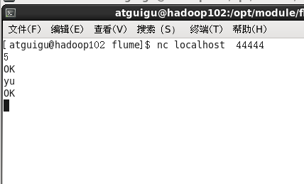
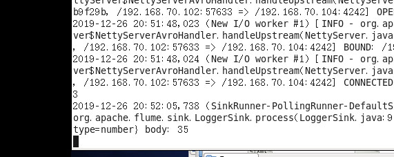
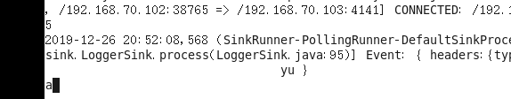


#自定义source
自定义source 继承AbstractSource实现两个接口，重写process方法

需求：使用flume接收数据，并给每条数据添加前缀，输出到控制台。前缀可从flume配置文件中配置。

根据官方说明自定义MySource需要继承AbstractSource类并实现Configurable和PollableSource接口。

实现相应方法：
```Java
public class MySource extends AbstractSource implements Configurable, PollableSource {

    //定义配置文件将来要读取的字段
    private Long delay;
    private String field;

    //初始化配置信息
    @Override
    public void configure(Context context) {
        //为了不一股脑输出，将来会在配置文件中设置delay的时间
        delay = context.getLong("delay");
        field = context.getString("field", "Hello!");
    }

    @Override
    public Status process() throws EventDeliveryException {

        try {
            //创建事件头信息
            HashMap<String, String> hearderMap = new HashMap<>();
            //创建事件
            SimpleEvent event = new SimpleEvent();
            //循环封装事件
            for (int i = 0; i < 5; i++) {
                //给事件设置头信息
                event.setHeaders(hearderMap);
                //给事件设置内容
                event.setBody((field + i).getBytes());
                //将事件写入channel
                getChannelProcessor().processEvent(event);
                Thread.sleep(delay);
            }
        } catch (Exception e) {
            e.printStackTrace();
            return Status.BACKOFF;
        }
        return Status.READY;
    }

    @Override
    public long getBackOffSleepIncrement() {
        return 0;
    }

    @Override
    public long getMaxBackOffSleepInterval() {
        return 0;
    }
}
```
将写好的代码打包，放flume/lib目录

配置文件
```
# Name the components on this agent
a1.sources = r1
a1.sinks = k1
a1.channels = c1

# Describe/configure the source
a1.sources.r1.type = com.kevin.MySource
a1.sources.r1.delay = 1000
#a1.sources.r1.field = atguigu

# Describe the sink
a1.sinks.k1.type = logger

# Use a channel which buffers events in memory
a1.channels.c1.type = memory
a1.channels.c1.capacity = 1000
a1.channels.c1.transactionCapacity = 100

# Bind the source and sink to the channel
a1.sources.r1.channels = c1
a1.sinks.k1.channel = c1
```

#自定义sink
Sink不断地轮询Channel中的事件且批量地移除它们，并将这些事件批量写入到存储或索引系统、或者被发送到另一个Flume Agent。

Sink是完全事务性的。在从Channel批量删除数据之前，每个Sink用Channel启动一个事务。批量事件一旦成功写出到存储系统或下一个Flume Agent，Sink就利用Channel提交事务。事务

一旦被提交，该Channel从自己的内部缓冲区删除事件。

实现相应方法：

configure(Context context)//初始化context（读取配置文件内容）

process()//从Channel读取获取数据（event），这个方法将被循环调用。

使用场景：读取Channel数据写入MySQL或者其他文件系统。

```Java
public class MySink extends AbstractSink implements Configurable {

    //创建Logger对象
    private static final Logger LOG = LoggerFactory.getLogger(AbstractSink.class);

    private String prefix;
    private String suffix;

    @Override
    public Status process() throws EventDeliveryException {

        //声明返回值状态信息
        Status status;

        //获取当前Sink绑定的Channel
        Channel ch = getChannel();

        //获取事务
        Transaction txn = ch.getTransaction();

        //声明事件
        Event event;

        //开启事务
        txn.begin();

        //读取Channel中的事件，直到读取到事件结束循环
        while (true) {
            event = ch.take();
            if (event != null) {
                break;
            }
        }
        try {
            //处理事件（打印）
            LOG.info(prefix + new String(event.getBody()) + suffix);

            //事务提交
            txn.commit();
            status = Status.READY;
        } catch (Exception e) {

            //遇到异常，事务回滚
            txn.rollback();
            status = Status.BACKOFF;
        } finally {

            //关闭事务
            txn.close();
        }
        return status;
    }

    @Override
    public void configure(Context context) {

        //读取配置文件内容，有默认值
        prefix = context.getString("prefix", "hello:");

        //读取配置文件内容，无默认值
        suffix = context.getString("suffix");
    }
}
```
#### Flume内存优化

如果启动消费后抛出异常
```
ERROR hdfs.HDFSEventSink: process failed
java.lang.OutOfMemoryError: GC overhead limit exceeded
```

需要在每台服务器的flume-env.sh增加

`export JAVA_OPTS="-Xms100m -Xmx2000m -Dcom.sun.management.jmxremote"`

JVM heap一般设置为4G或更高，部署在单独的服务器上（4核8线程16G内存）
-Xmx与-Xms最好设置一致，减少内存抖动带来的性能影响，如果设置不一致容易导致频繁fullgc

#### 组件
1）FileChannel和MemoryChannel区别

MemoryChannel传输数据速度更快，但因为数据保存在JVM的堆内存中，Agent进程挂掉会导致数据丢失，适用于对数据质量要求不高的需求。

FileChannel传输速度相对于Memory慢，但数据安全保障高，Agent进程挂掉也可以从失败中恢复数据。

2）FileChannel优化

通过配置dataDirs指向多个路径，每个路径对应不同的硬盘，增大Flume吞吐量。

3）Sink：HDFS Sink

（1）HDFS存入大量小文件，有什么影响？

元数据层面：每个小文件都有一份元数据，其中包括文件路径，文件名，所有者，所属组，权限，创建时间等，这些信息都保存在Namenode内存中。所以小文件过多，会占用Namenode服务器大量内存，影响Namenode性能和使用寿命

计算层面：默认情况下MR会对每个小文件启用一个Map任务计算，非常影响计算性能。同时也影响磁盘寻址时间。

	（2）HDFS小文件处理

官方默认的这三个参数配置写入HDFS后会产生小文件，hdfs.rollInterval、hdfs.rollSize、hdfs.rollCount

基于以上hdfs.rollInterval=3600，hdfs.rollSize=134217728，hdfs.rollCount =0几个参数综合作用，效果如下：

（1）文件在达到128M时会滚动生成新文件

（2）文件创建超3600秒时会滚动生成新文件
