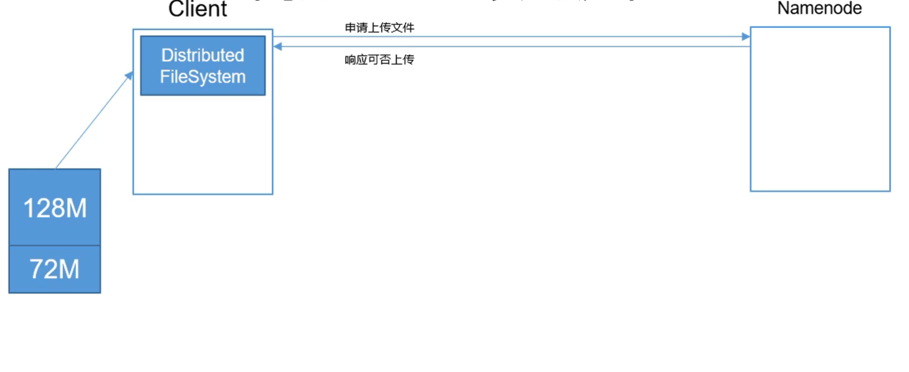
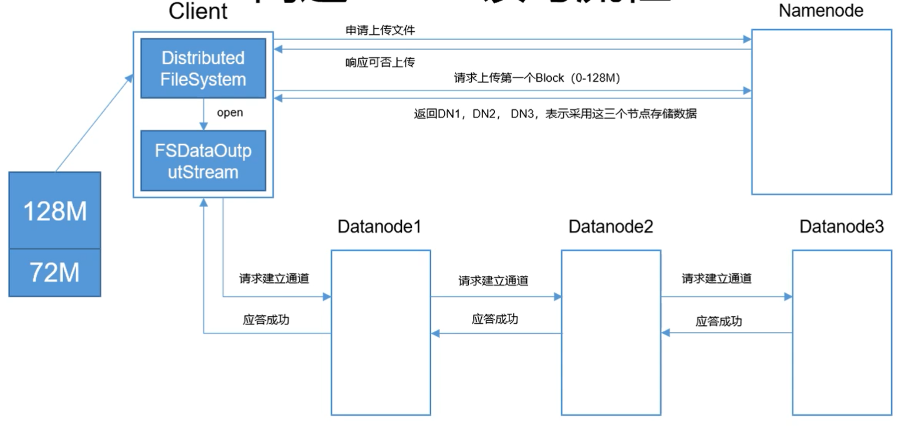
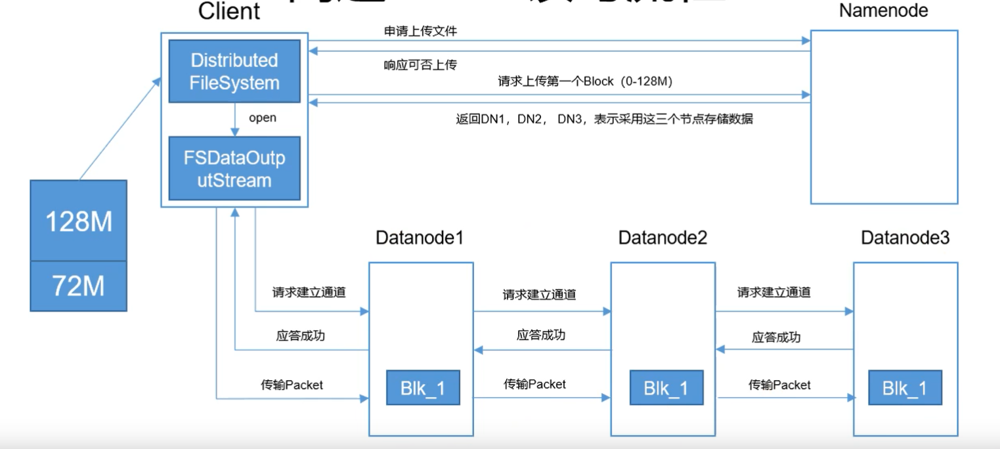
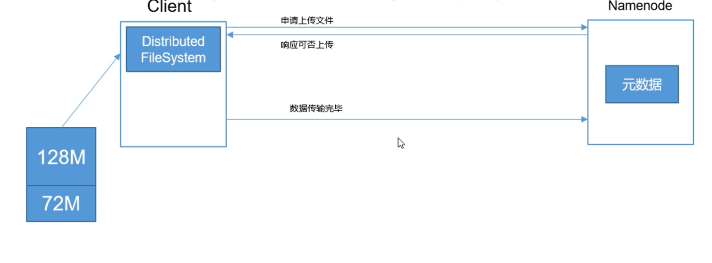
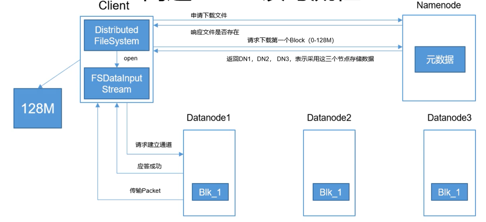
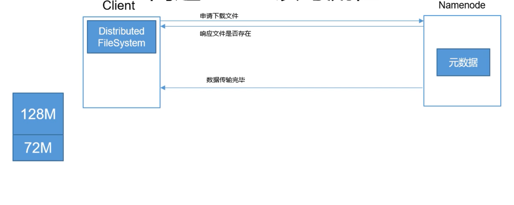
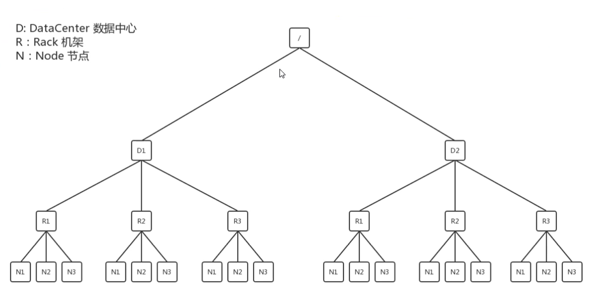

# HDFS的读写流程

#### 读流程
首先客户端会询问namenode是否可以上传文件，在得到确认后客户端会将待上传文件按照128MB切割

然后客户端会请求上传第一个block， 通过namenode得知可以上传的datanode的地址(datanode的数量和指定的副本数一致)。客户端开一个数据写出流，向最近的一台机器发送请求建立连接，这个请求通过可以上传的datanode依次传递，然后又把应答成功依次传回来。

这时候客户端向最近的datanode传输block，在第一个datanode从内存向硬盘中落盘的同时，向下一个datanode传输。需要注意的是，两个不同的block不一定存在同一组datanode中

数据传输完毕，客户端关闭数据输出流，namenode更新元数据

#### 写流程
客户端会向namenode发送下载申请，namenode检查文件存在以及客户端权限无误后会确认。这时客户端发送下载第一个block的请求，然后打开数据写入流，联系最近的datanode，应答成功后传输。如果这个datanode没有响应，客户端会联系下一个datanode

传输完成

#### 网络拓扑的距离最近

N代表节点，R代表路由器，D代表数据中心，N1到N2距离就是2(途径两个路径)。距离就是基于这个原则计算的。如果副本数是3，就是本身一个，同机架不同节点一个，不同机架一个。
