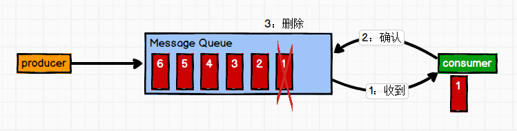
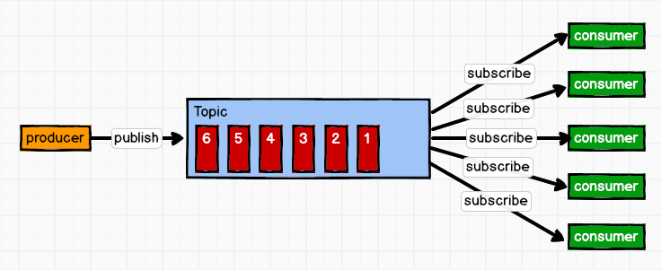
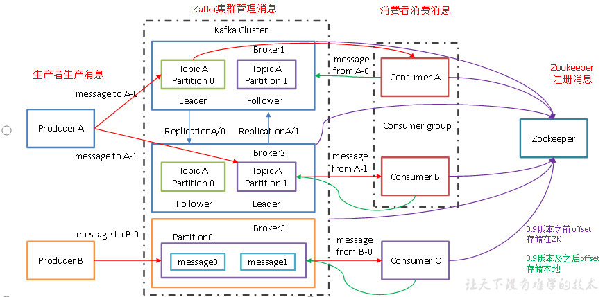

#Kafka&消息队列概述
<hr style="height:1px;border:none;border-top:1px solid #555555;" />
Kafka是一种基于发布订阅模式的消息队列，应用于大数据实时处理领域

消息队列有两种形式：

同步处理：注册后写入注册数据库，发送短信请求处理完后响应注册成功（对并发不太友好）

异步处理：注册后写入注册数据库，直接给用户返回成功。同时放到消息队列，向信息消费者发送短信处理，把中间的步骤做了解耦

消息队列的好处：
解耦：允许你独立的扩展或修改两边的处理过程，只要确保它们遵守同样的接口约束。

可恢复性：中间一个进程挂掉，恢复后还可以处理加入队列的消息。

缓冲：控制生产消息和消费消息速度不一致问题（峰值处理能力）

异步通信：用户可以向队列中放很多消息，然后在需要的时候再去处理它们。

消息队列的两种模式

####1.点对点：
一对一，消费者主动拉取数据。收到消息后清除消息


消息生产者生产消息发送到Queue中，然后消息消费者从Queue中取出并且消费消息。消息被消费以后，queue中不再有存储，所以消息消费者不可能消费到已经被消费的消息。Queue支持存在多个消费者，但是对一个消息而言，只会有一个消费者可以消费

####2.发布订阅：
消费者消费后不会清除消息,生产者将消息发布到topic(订阅主题)中，同时有多个消息消费者消费该消息。和点对点方式不同，发布到topic的消息会被所有订阅者消费。


##Kafka框架
<hr style="height:1px;border:none;border-top:1px solid #555555;" />


1）Producer ：消息生产者，向kafka broker发消息的客户端；

2）Consumer ：消息消费者，向kafka broker收取消息的客户端，消费者主动拉取数据，没有数据会timeout等待一段时间；

3）Consumer Group ：消费者组，由多个consumer组成。消费者组内每个消费者负责消费不同分区的数据，一个分区只能由一个组内消费者消费；消费者组之间互不影响。所有的消费者都属于某个消费者组，即消费者组是逻辑上的一个订阅者。

4）Broker ：一台kafka服务器就是一个broker。一个集群由多个broker组成。一个broker可以容纳多个topic。

5）Topic ：可以理解为一个队列，生产者和消费者面向的都是一个topic；

6）Partition：为了实现扩展性，一个非常大的topic可以分布到多个broker（即服务器）上，一个topic可以分为多个partition，每个partition是一个有序的队列。topic分区也是为了提高并发性（性能最好的情况下是一个partition给一个消费者）。

7）Replica：副本，为保证集群中的某个节点发生故障时，该节点上的partition数据不丢失，且kafka仍然能够继续工作，kafka提供了副本机制，一个topic的每个分区都有若干个副本，一个leader和若干个follower。

8）leader：每个分区多个副本的“主”，生产者发送数据的对象，以及消费者消费数据的对象都是leader。leader和follower的partition一致，存在不同的cluster备份

9）follower：每个分区多个副本中的“从”，实时从leader中同步数据，保持和leader数据的同步。leader发生故障时，某个follower会成为新的leader。

#安装与部署
<hr style="height:1px;border:none;border-top:1px solid #555555;" />

<a href = 'http://kafka.apache.org/downloads.html'>官方下载地址</a>

解压后新建一个log文件夹专门放kafka的消息，这里需要注意这个不是日志地址，kafka中log是消息
`mkdir logs`
进入conf修改配置文件server.properties
```
#broker的全局唯一编号，不能重复
broker.id=0
#开启删除topic功能
delete.topic.enable=true
#处理网络请求的线程数量
num.network.threads=3
#用来处理磁盘IO的线程数量
num.io.threads=8
#发送套接字的缓冲区大小
socket.send.buffer.bytes=102400
#接收套接字的缓冲区大小
socket.receive.buffer.bytes=102400
#请求套接字的缓冲区大小
socket.request.max.bytes=104857600
#kafka运行日志存放的路径
log.dirs=/opt/module/kafka/logs
#topic在当前broker上的分区个数
num.partitions=1
#用来恢复和清理data下数据的线程数量
num.recovery.threads.per.data.dir=1
#segment文件保留的最长时间，超时将被删除
log.retention.hours=168
#配置连接Zookeeper集群地址
zookeeper.connect=hadoop102:2181,hadoop103:2181,hadoop104:2181
```
给集群中的其他服务器都装上kafka，把配置文件终端broker.id做相应调整

#操作
<hr style="height:1px;border:none;border-top:1px solid #555555;" />

启动kafka
`bin/kafka-server-start.sh -daemon config/server.properties`
关闭kafka
`bin/kafka-server-stop.sh stop`

如果觉得不方便可以写启动脚本进行群起群关
```shell
for i in hadoop102 hadoop103 hadoop104
do
echo "========== $i =========="
ssh $i '/opt/module/kafka/bin/kafka-server-start.sh -daemon /opt/module/kafka/config/server.properties'
done
```

群起后(记得先开zookeeper)，查看当前服务器中的所有topic
```
bin/kafka-topics.sh --zookeeper hadoop102:2181 --list
```
创建topic
```
bin/kafka-topics.sh --zookeeper hadoop102:2181 --create --replication-factor 3 --partitions 1 --topic first
```
--topic 主题名
--replication-factor 副本数（不能多于broker数）
--partitions 你的topic想分成几份partition
删除topic
```
bin/kafka-topics.sh --zookeeper hadoop102:2181 --delete --topic first
```
产生消息
```
bin/kafka-console-producer.sh  --broker-list hadoop102:9092 --topic first
```
9092是Kafka默认通信端口

同时可接收线程
```
bin/kafka-console-consumer.sh --zookeeper hadoop102:2181 --topic first
```
会报一个警告：Using the ConsoleConsumer with old consumer is deprecated and will be removed in a future major release. Consider using the new consumer by passing [bootstrap-server] instead of [zookeeper]. 这样消费者的offset都会记录到zookeeper中，新版Kafka可以直接存在kafka机器中

按他的提示这样写
```
bin/kafka-console-consumer.sh --bootstrap-server hadoop102:9092 --topic first
```
额外加一个--from-beginning会把主题中以往所有的数据都读取出来

查看topic详情
`bin/kafka-topics.sh --zookeeper hadoop102:2181 --describe --topic first`
#工作流程
轮询给broker
每个partition一个offset


#生产者
分区策略
扩展
高并发


分区的原则
指定partition
没指定partition ,给了key 用hashcode
都没给就给一个自增的随机数%分区数

#数据可靠性的保证
每个partition收到数据都会反馈ack，否则生产者重发
全部follower收到数据后再发送ack
为了保证个别floower挂掉后没法ack,用ISR
新版的差值已经remove了

应答机制：0 不用等broker ack
1等ack leader成功就ack
-1 等待全部落盘

故障处理细节
LEO 每个副本的最后一个offset
HW 最小的东西 消费者能见到的

挂了后剩下的follower互相同步

挂了的后面就是丢了

# 分区分配策略
range——robin 一个组的消费者订阅的主题应该是一样的 组为单位

range topic为单位
