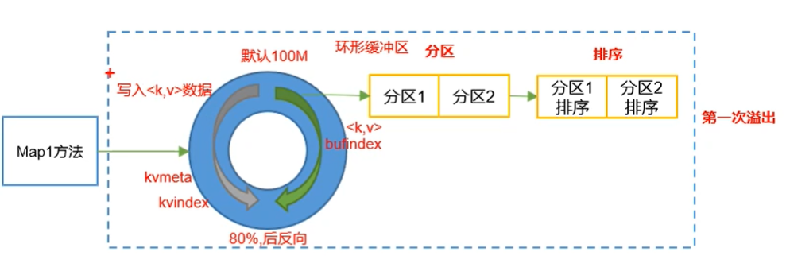
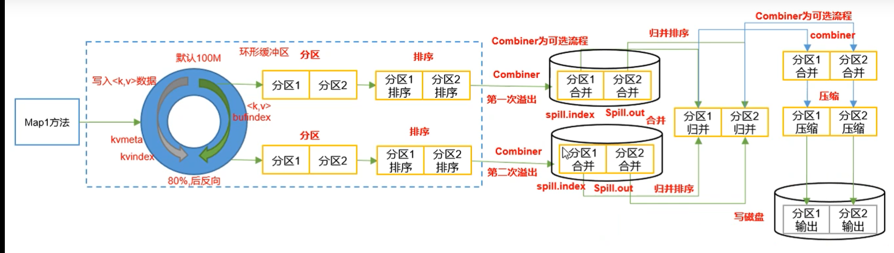
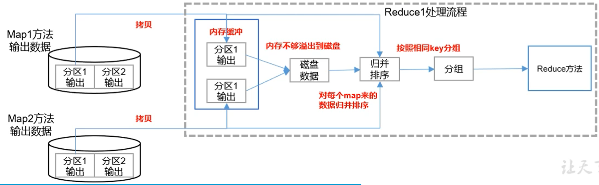

#shuffle机制

数据从map端以KV形式写出的时候，还带有分区好P(默认是用key的hashcode算出)，来到环形缓冲区后发生溢写。再u按行缓冲区就已经做好比较排序了，先比较分区号，再比较k大小，这样分区了，分区内按照p有序。

combimer是可选的过程，就是再map端先进行一次类似reduce的操作用以减轻网络传输io负荷。需要注意的是求平均数不适合这个操作。

每个map分区都分配一个reduce端进行操作，就是把同一分区不同的输出进行归并排序。如果内存不够用就溢出到磁盘。

#### 环形缓冲区工作机制
从中间一点开始，一侧写KV数据。另一侧写KV数据的地址。当缓冲区达到80%的时候发生溢写，同时再剩下20%的地方找个地方，还是一侧写KV数据，另一侧写地址。这样可以做到溢写同时还不耽误写入。再排序的过程中，只交换内存地址索引位置。
